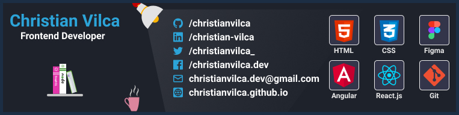

Hi there, I'm Christian Vilca.

Self-taught focused on web technology.

Able to solve logic problems by adapting the code for a specific need, using good practices.

## Contact

## Skills
### Frontend

### Backend

### Other technologies

